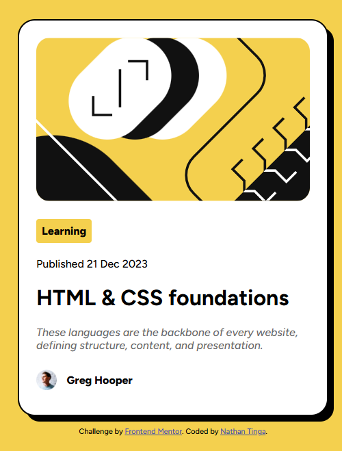

# Frontend Mentor - Blog preview card solution

This is a solution to the [Blog preview card challenge on Frontend Mentor](https://www.frontendmentor.io/challenges/blog-preview-card-ckPaj01IcS). Frontend Mentor challenges help you improve your coding skills by building realistic projects. 

## Table of contents

- [Overview](#overview)
  - [The challenge](#the-challenge)
  - [Screenshot](#screenshot)
  - [Links](#links)
- [My process](#my-process)
  - [Built with](#built-with)
  - [What I learned](#what-i-learned)
  - [Continued development](#continued-development)

**Note: Delete this note and update the table of contents based on what sections you keep.**

## Overview

### The challenge

Users should be able to:

- See hover and focus states for all interactive elements on the page

### Screenshot

### Links

- Solution URL: [Add solution URL here](https://github.com/NathanTinga/02-blog-preview-card)
- Live Site URL: [Add live site URL here](https://nathantinga.github.io/02-blog-preview-card)

## My process
I started by assembling the needed dom elements, considering the use of semantic elements where it made sense. I then dis a first pass to try and nail down the approximate feel using sizing and alignment. Lastly I did a final pass where I added the link and hover responsiveness, and cleaned up the formatting (particularly for the "Learning" tag that I missed).
### Built with

- Semantic HTML5 markup
- CSS custom properties
- Flexbox
- CSS Grid

### What I learned

I learned:

-how to load custom fonts without an api call
-how to use "fit-content" for clean bubbles/tags
-use inheritance to pass rules from a header to a nested link

### Continued development

I can see the use of tags and responsive elements useful for my continued development of IoT widgets.